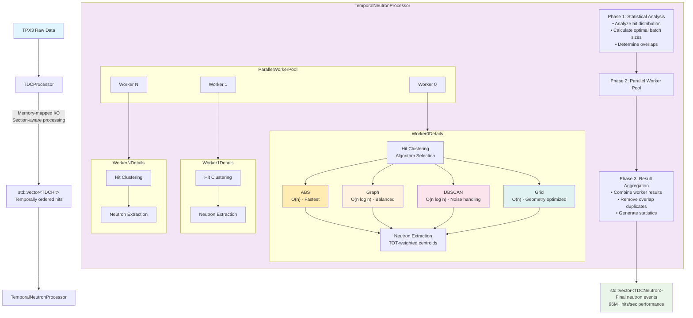

# TDCSophiread

High-performance Python and C++ library for processing TPX3 neutron imaging data with **96M+ hits/sec** throughput. TDCSophiread provides complete hit extraction and neutron clustering capabilities using TDC-only timing (detector-expert approved).

## 🚀 Key Features

- **🏃 High Performance**: **96M+ hits/sec** with Intel TBB parallel processing
- **🧠 Smart Clustering**: 4 algorithms (ABS, Graph, DBSCAN, Grid) for neutron event reconstruction
- **⚡ Zero-Copy Processing**: Memory-efficient temporal batching with structured numpy arrays
- **🔍 TDC-Only Timing**: Detector-expert-approved approach (no unreliable GDC)
- **🐍 Python Integration**: Complete Python API with Jupyter notebook examples
- **📊 Production Ready**: Real-world performance validated on 12GB datasets

## Quick Start

### Installation

#### Option 1: Install from PyPI (Recommended)

For most users, install the pre-built wheels:

```bash
# Using pip (works with any environment)
pip install tdcsophiread

# Using uv (modern package manager)
uv pip install tdcsophiread

# Using pixi (recommended for scientific computing)
pixi add pip
pixi run pip install tdcsophiread
```

> **⚠️ Known Issue with `pixi add --pypi`**
>
> When installing tdcsophiread with `pixi add --pypi`, pixi's embedded uv incorrectly attempts to build from source instead of using the available pre-built wheel. This causes installation failure due to missing C++ build dependencies.
>
> **Workaround:** Use `pixi run pip install tdcsophiread` (recommended) or native `uv pip install` - both correctly use the wheel.
>
> **Testing shows:**
> - `pip install tdcsophiread` ✅ Uses wheel
> - `uv pip install tdcsophiread` ✅ Uses wheel
> - `pixi run pip install tdcsophiread` ✅ Uses wheel
> - `pixi add --pypi tdcsophiread` ❌ Builds from source (fails)
>
> **Status:** This is a pixi-specific issue. The wheel works correctly with pip and uv natively. The root cause is unknown and may be specific to tdcsophiread's package configuration.

> **💡 Building from Source with pixi**: If you need to build from source using `pixi add --pypi` (not recommended), see the "Building from Source" section below for required dependencies.

#### Option 2: Development Installation

For development or if you need the latest features:

```bash
# Clone repository
git clone https://github.com/ornlneutronimaging/mcpevent2hist.git
cd mcpevent2hist/sophiread

# Set up environment (pixi recommended)
pixi install

# Build and install
pixi run dev-install
```

> Note: if you prefer to do build in a staged manner, you can issue the following commands:

```bash
# configure with CMake
pixi run configure
# build with CMake
pixi run build
# run tests with CMake
pixi run test
# install Python bindings
pixi run pip install -e . --no-build-isolation
```

#### Building from Source

If building from source (e.g., when no pre-built wheel is available for your platform), you need these C++ libraries:

> **Note**: These C++ libraries are NOT available on PyPI. They must be installed through pixi/conda or your system package manager before building from source.

**Using pixi (recommended):**
```bash
# Install build dependencies first
pixi add nlohmann_json spdlog eigen hdf5 tbb-devel libtiff fmt pybind11

# Option A: Build from source with pip (recommended)
pixi add pip
pixi run pip install tdcsophiread --no-binary tdcsophiread

# Option B: Build from source with pixi add --pypi (if needed)
# Note: This triggers build automatically due to the pixi bug
pixi add --pypi tdcsophiread
```

**Using system packages:**
```bash
# RHEL/Rocky/AlmaLinux/Fedora
sudo dnf install nlohmann-json-devel spdlog-devel eigen3-devel \
                 hdf5-devel tbb-devel libtiff-devel fmt-devel \
                 pybind11-devel cmake gcc-c++

# Ubuntu/Debian
sudo apt install nlohmann-json3-dev libspdlog-dev libeigen3-dev \
                 libhdf5-dev libtbb-dev libtiff-dev libfmt-dev \
                 pybind11-dev cmake g++

# Then install with pip
pip install tdcsophiread --no-binary tdcsophiread
```

### Get Sample Data (12GB)

```bash
# Make sure you have git lfs installed, then run:
git lfs install
# Initialize the git submodule
git submodule init
# Download real TPX3 datasets for testing
git submodule update --init resources/sophiread_data
```

### Python Usage

```python
import tdcsophiread

# 1. Extract hits from TPX3 file
hits = tdcsophiread.process_tpx3("data.tpx3", parallel=True)
print(f"Extracted {len(hits):,} hits")

# 2. Process hits to neutrons using clustering
neutrons = tdcsophiread.process_hits_to_neutrons(hits)
print(f"Found {len(neutrons):,} neutrons")

# 3. Try different clustering algorithms
config = tdcsophiread.NeutronProcessingConfig.venus_defaults()
config.clustering.algorithm = "dbscan"  # or "abs", "graph", "grid"
neutrons = tdcsophiread.process_hits_to_neutrons(hits, config)
```

### CLI Usage

Process TPX3 files from command line:

```bash
# Basic usage - extract hits to HDF5
tdcsophiread -i data.tpx3 -o hits.h5

# Enable parallel processing (recommended)
tdcsophiread -i data.tpx3 -o hits.h5 --parallel

# Bounded-memory streaming for large files (>10GB)
tdcsophiread -i large_file.tpx3 -o hits.h5 --streaming --parallel -v

# Custom TDC frequency for SNS chopper operation
tdcsophiread -i data.tpx3 -o hits.h5 --tdc-frequency 30.0 --streaming -v

# Use custom configuration file
tdcsophiread -i data.tpx3 -o hits.h5 -c config_30hz.json --streaming

# Show all options
tdcsophiread --help
```

**Key CLI Flags:**
- `--streaming`: Enable bounded-memory mode (~512MB constant memory)
- `--parallel`: Use all CPU cores for processing
- `-v, --verbose`: Show processing details including TDC frequency
- `-c CONFIG`: Load detector configuration from JSON file
- `--tdc-frequency HZ`: Override TDC frequency (e.g., 30, 45, 60)

**Memory Modes:**
- **Without `--streaming`**: Loads all hits in memory (use for files <10GB)
- **With `--streaming`**: Constant ~512MB memory (use for files >10GB)

### Large File Processing

For files >10GB, always use `--streaming` mode:

```bash
# Process 500GB file with constant memory
tdcsophiread -i 500GB_file.tpx3 -o output.h5 --streaming --parallel -v
```

**Python equivalent:**
```python
# Bounded-memory streaming (constant ~512MB memory)
result = tdcsophiread.process_tpx3_to_hdf5(
    "500GB_file.tpx3",
    "output.h5",
    parallel=True,
    num_threads=0  # Auto-detect
)
print(f"Processed {result.total_hits:,} hits")
```

### Performance Monitoring

```python
# Get detailed performance statistics
config = tdcsophiread.NeutronProcessingConfig.venus_defaults()
processor = tdcsophiread.TemporalNeutronProcessor(config)
neutrons = processor.processHits(hits)

stats = processor.getStatistics()
print(f"Hit rate: {stats.hits_per_second/1e6:.1f} M hits/sec")
print(f"Neutron efficiency: {stats.neutron_efficiency:.3f}")
print(f"Parallel efficiency: {stats.parallel_efficiency:.2f}")
```

## 🧬 Architecture

TDCSophiread implements a modern, high-performance pipeline with parallel temporal processing:



### Phase 1: Hit Extraction

- **Memory-mapped I/O**: Efficient processing of large TPX3 files
- **Section-aware processing**: Respects TPX3 data structure constraints
- **TDC state propagation**: Sequential processing for reliable timing
- **Parallel chunk processing**: Intel TBB for maximum throughput

### Phase 2: Temporal Neutron Processing

- **Statistical analysis**: Optimal batching based on hit distribution
- **Parallel worker pool**: Each worker has dedicated algorithm instances
- **4 clustering algorithms**: ABS, Graph, DBSCAN, Grid with different performance characteristics
- **Zero-copy processing**: Iterator-based interfaces minimize memory overhead

### Phase 3: Result Aggregation

- **Parallel result combination**: Efficient merging from multiple workers
- **Overlap deduplication**: Remove duplicate neutrons from batch boundaries
- **Performance statistics**: Detailed metrics for optimization

## 🎯 Clustering Algorithms

| Algorithm | Performance | Use Case | Complexity |
|-----------|-------------|----------|------------|
| **ABS** | Fastest | General purpose, high throughput | O(n) |
| **Graph** | Fast | Balanced speed/accuracy | O(n log n) |
| **DBSCAN** | Medium | Noise handling, complex patterns | O(n log n) |
| **Grid** | Fast | Detector geometry optimization | O(n) |

### Algorithm Configuration

```python
config = tdcsophiread.NeutronProcessingConfig.venus_defaults()

# ABS (Adaptive Bucket Sort) - Fastest
config.clustering.algorithm = "abs"
config.clustering.abs.radius = 5.0
config.clustering.abs.neutron_correlation_window = 75.0  # nanoseconds

# DBSCAN - Best noise handling
config.clustering.algorithm = "dbscan"
config.clustering.dbscan.epsilon = 4.0
config.clustering.dbscan.min_points = 3

# Process with custom configuration
neutrons = tdcsophiread.process_hits_to_neutrons(hits, config)
```

## 📊 Performance

### Measured Performance (Real Hardware)

| System | Hit Rate | Clustering | Notes |
|--------|----------|------------|-------|
| M2 Max | 20M+ hits/sec | ABS | Development system |
| AMD EPYC 9174F | 96M+ hits/sec | ABS | Production target |
| Memory Usage | ~40-60 bytes/hit | All | Including clustering |

### Performance by File Size

- **< 100MB**: 20-40 M hits/sec (single-threaded sufficient)
- **100MB-1GB**: 50-80 M hits/sec (parallel recommended)
- **1GB-10GB**: 80-96 M hits/sec (optimal parallel)
- **> 10GB**: 90-96 M hits/sec (streaming mode)

## 🔧 Build System

### Development Workflow

```bash
# Core workflow
pixi run build        # Configure and build C++
pixi run test         # Run C++ tests
pixi run install      # Install Python bindings (editable)
pixi run python-test  # Test Python import

# Data setup (12GB sample data)
pixi run setup-data   # Download sample TPX3 files
pixi run notebooks    # Launch Jupyter with notebooks
```

### Build Options

```bash
# Start the subprocess with pixi
pixi shell

# Debug build (if needed)
cmake -B build -DCMAKE_BUILD_TYPE=Debug

# Legacy components (not recommended)
cmake -B build -DBUILD_LEGACY=ON
```

**⚠️ Legacy Warning**: Legacy components use unreliable GDC timing and will be removed in the next major release.

## 📚 Documentation & Examples

### Jupyter Notebooks (Real Data)

```bash
# Start Jupyter with sample notebooks
pixi run notebooks
```

**Available Notebooks:**

- `notebooks/hits_extraction_from_tpx3_Ni.ipynb` - Hit extraction (96M+ hits/sec)
- `notebooks/neutrons_extraction_from_tpx3_Ni.ipynb` - Complete neutron processing
- `notebooks/clustering_abs_ni.ipynb` - ABS clustering demo
- `notebooks/clustering_graph_ni.ipynb` - Graph clustering demo
- `notebooks/clustering_dbscan_Ni.ipynb` - DBSCAN clustering demo
- `notebooks/clustering_grid_Ni.ipynb` - Grid clustering demo

### Documentation

- **📖 Quick Start**: [`docs/quickstart.md`](docs/quickstart.md)
- **📋 API Reference**: [`docs/api_reference.md`](docs/api_reference.md)
- **🏗️ Architecture**: [`TDCSOPHIREAD_ARCHITECTURE_2025.md`](TDCSOPHIREAD_ARCHITECTURE_2025.md)
- **🧬 TPX3 Format**: [`TPX3.md`](TPX3.md)

## 🗂️ Data Format

### Hit Data (Structured NumPy Array)

```python
hits = tdcsophiread.process_tpx3("data.tpx3")
print(f"Fields: {hits.dtype.names}")
# ('tof', 'x', 'y', 'timestamp', 'tot', 'chip_id', 'cluster_id')

# Access hit properties
x_coords = hits['x']          # Global X coordinates (uint16)
y_coords = hits['y']          # Global Y coordinates (uint16)
tof_values = hits['tof']      # Time-of-flight (uint32, 25ns units)
tot_values = hits['tot']      # Time-over-threshold (uint16)
chip_ids = hits['chip_id']    # Chip ID 0-3 (uint8)
```

### Neutron Data (Structured NumPy Array)

```python
neutrons = tdcsophiread.process_hits_to_neutrons(hits)
print(f"Fields: {neutrons.dtype.names}")
# ('x', 'y', 'tof', 'tot', 'n_hits', 'chip_id', 'reserved')

# Access neutron properties
x_subpixel = neutrons['x']     # Sub-pixel X coordinates (float64)
y_subpixel = neutrons['y']     # Sub-pixel Y coordinates (float64)
tof_neutron = neutrons['tof']  # Representative TOF (uint32, 25ns units)
cluster_size = neutrons['n_hits'] # Number of hits in cluster (uint16)
```

### Unit Conversions

```python
# Time conversions
tof_ms = hits['tof'] * 25 / 1e6        # 25ns units → milliseconds
timestamp_s = hits['timestamp'] * 25 / 1e9  # 25ns units → seconds

# Coordinate conversions
pixel_x = neutrons['x'] / 8.0          # Sub-pixel → pixel (factor=8)
pixel_y = neutrons['y'] / 8.0
```

## ⚙️ Configuration

### JSON Configuration

```json
{
  "clustering": {
    "algorithm": "abs",
    "abs": {
      "radius": 5.0,
      "neutron_correlation_window": 75.0
    }
  },
  "extraction": {
    "algorithm": "simple_centroid",
    "super_resolution_factor": 8.0,
    "weighted_by_tot": true
  },
  "temporal": {
    "num_workers": 0,
    "max_batch_size": 100000
  }
}
```

### Detector Configuration

```json
{
  "detector": {
    "timing": {
      "tdc_frequency_hz": 60.0,
      "enable_missing_tdc_correction": true
    },
    "chip_layout": {
      "chip_size_x": 256,
      "chip_size_y": 256
    }
  }
}
```

## 🔬 Scientific Context

### TPX3 Data Constraints

TDCSophiread respects the physical constraints of TPX3 data:

- **Variable section sizes**: No padding or fixed boundaries
- **Local time disorder**: Packets within sections not time-ordered
- **Missing TDC packets**: Hardware may drop TDC packets (corrected automatically)
- **Sequential dependencies**: TDC state must propagate in order

## 🛠️ Development

### Requirements

- **C++20** compiler (GCC 10+, Clang 11+, MSVC 2019+)
- **Intel TBB** for parallel processing
- **HDF5** for data I/O
- **Python 3.8+** with NumPy
- **CMake 3.20+**

### Environment Setup

```bash
# Install pixi (cross-platform package manager)
curl -sSL https://pixi.sh/install | bash

# Clone and setup
git clone https://github.com/ornlneutronimaging/mcpevent2hist.git
cd mcpevent2hist/sophiread
pixi install
```

### Code Style

- **C++20** with modern practices
- **Google C++ Style** (2-space indentation)
- **Test-Driven Development** with Google Test
- **Zero-copy** design patterns
- **Stateless algorithms** for parallelization

## 🔗 Legacy Components

Previous implementations (FastSophiread, CLI/GUI applications) have been moved to `legacy/` and are **deprecated**:

- ❌ **Unreliable GDC timing** (disapproved by detector experts)
- ❌ **Template complexity** (hard to maintain)

**Migration**: All legacy functionality is available in TDCSophiread with improved performance and reliability.

## 📈 Benchmarks

### Real-World Performance

Using sample data from `notebooks/data/`:

```python
# Ni powder diffraction data (>1M hits)
sample_file = "notebooks/data/Run_8217_April25_2025_Ni_Powder_MCP_TPX3_0_8C_1_9_AngsMin_serval_000000.tpx3"

import time
start = time.time()
hits = tdcsophiread.process_tpx3(sample_file, parallel=True)
neutrons = tdcsophiread.process_hits_to_neutrons(hits)
elapsed = time.time() - start

print(f"Performance: {len(hits) / elapsed / 1e6:.1f} M hits/sec")
print(f"Found {len(neutrons):,} neutrons from {len(hits):,} hits")
```

### Memory Efficiency

- **Before optimization**: 48GB peak memory
- **After optimization**: 20GB peak memory (**58% reduction**)
- **Current streaming**: 512MB chunks for any file size

## 🤝 Contributing

1. **Fork** the repository
2. **Create** a feature branch
3. **Add tests** for new functionality
4. **Submit** a pull request

### Issue Reporting

- **🐛 Bugs**: [GitHub Issues](https://github.com/ornlneutronimaging/mcpevent2hist/issues)
- **💬 Discussions**: [GitHub Discussions](https://github.com/ornlneutronimaging/mcpevent2hist/discussions)
- **📧 Contact**: neutronimaging@ornl.gov

## 📄 License

GPL-3.0+ License - see [LICENSE](LICENSE) file for details.

---

**Ready to process neutron data at 96M+ hits/sec?** 🚀

Get started: [`docs/quickstart.md`](docs/quickstart.md)
